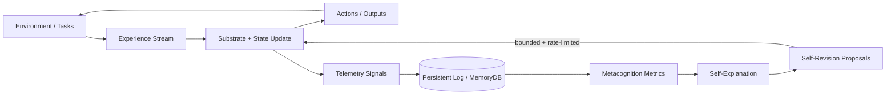
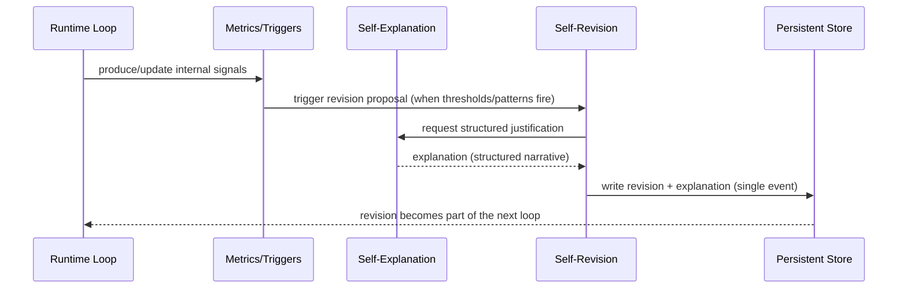

# NeuroForge Architecture (Public Overview)

NeuroForge is organized around a small number of interacting loops that make internal state, internal change, and internal justification observable.

This is a foundational research prototype — not a product.

## Architecture At A Glance

NeuroForge can be read as a pipeline plus feedback loops:
- Experience updates internal state
- Internal state produces actions/outputs
- Telemetry persists internal signals
- Metacognition interprets those signals
- Explanation converts triggers into structured narratives
- Revision proposes bounded parameter updates under safety constraints

## Core Components (Conceptual)

- Substrate: Maintains a running internal state that updates from experience.
- Memory / Persistence: Stores experience and internal measurements so they can be inspected later.
- Metacognition: Computes higher-level reliability signals (e.g., trust/coherence trends) from persisted telemetry.
- Self-Explanation: Produces a structured narrative for “why a change is being proposed.”
- Self-Revision: Proposes limited parameter deltas when triggers fire, subject to explicit safety constraints.
- Safety / Envelope: Constrains what changes are allowed, how frequently they can occur, and what must be recorded.

## Audit Trail (Change + Justification)

The architecture is designed so “change” and “justification” are coupled as an auditable event.

## Why This Shape

The goal is not maximal capability. The goal is a coherent substrate where you can ask, for any internal change:
- What metric triggered it?
- Why was this parameter selected?
- Why was this delta considered safe?
- Where is the record of the change and its justification?
