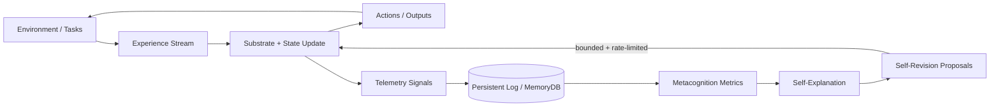
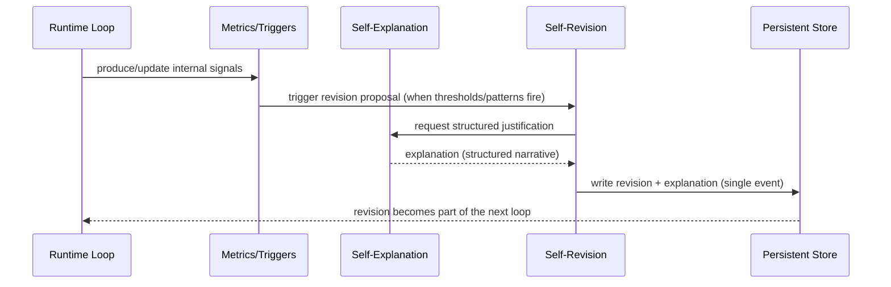
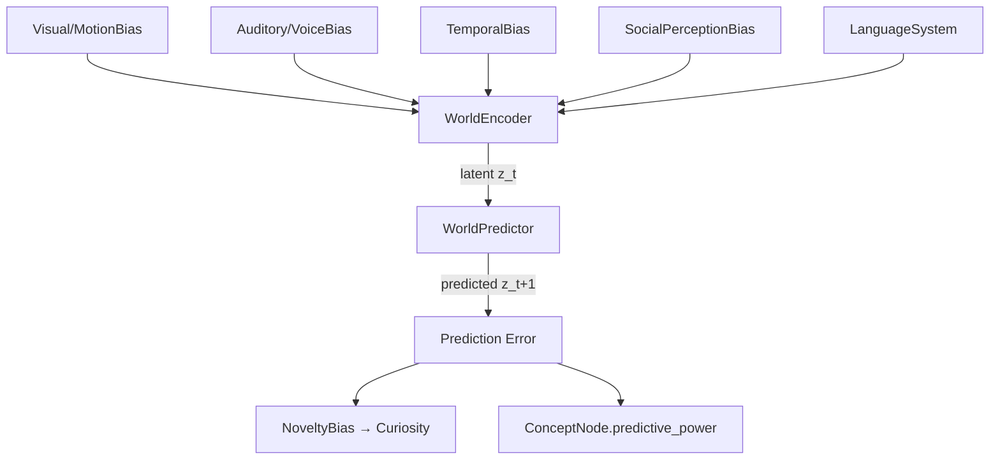
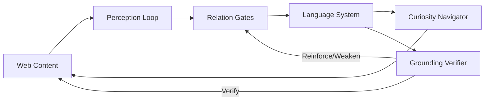

# NeuroForge Architecture (Public Overview)

> **Governance engines changed 2026-08-22.** `ContractAcceptanceEngine` gained an
> optional `ContractStore` and a privilege-escalation check (Check 8): previously it
> evaluated every proposal in isolation and **accepted** a contract that widened
> `speak_only` to `full_access` while dropping its predecessor's restrictions. Both it
> and `RoleAcceptanceEngine` also had their check order changed so the narrowest
> jurisdiction governs — the set of rejected proposals is unchanged, only the reported
> reason. Landed without re-ratification by owner decision. Detail:
> `Validation_notes/governance_engine_changes_2026-08-22.md`


NeuroForge is organized around a small number of interacting loops that make internal state, internal change, and internal justification observable.

This is a foundational research prototype — not a product.

## Architecture At A Glance

NeuroForge can be read as a pipeline plus feedback loops:
- Experience updates internal state
- Internal state produces actions/outputs
- Telemetry persists internal signals
- Metacognition interprets those signals
- Explanation converts triggers into structured narratives
- Revision proposes bounded parameter updates under safety constraints


```mermaid
flowchart LR
  E[Environment / Tasks] --> X[Experience Stream]
  X --> S[Substrate + State Update]
  S --> A[Actions / Outputs]
  A --> E

  S --> T[Telemetry Signals]
  T --> P[(Persistent Log / MemoryDB)]

  P --> M[Metacognition Metrics]
  M --> EX[Self-Explanation]
  EX --> R[Self-Revision Proposals]
  R -->|bounded + rate-limited| S
```

## Core Components (Conceptual)

- Substrate: Maintains a running internal state that updates from experience.
- Memory / Persistence: Stores experience and internal measurements so they can be inspected later.
- Metacognition: Computes higher-level reliability signals (e.g., trust/coherence trends) from persisted telemetry.
- Self-Explanation: Produces a structured narrative for “why a change is being proposed.”
- Self-Revision: Proposes limited parameter deltas when triggers fire, subject to explicit safety constraints.
- Safety / Envelope: Constrains what changes are allowed, how frequently they can occur, and what must be recorded.

## Audit Trail (Change + Justification)

The architecture is designed so “change” and “justification” are coupled as an auditable event.


```mermaid
sequenceDiagram
  participant Runtime as Runtime Loop
  participant Metrics as Metrics/Triggers
  participant Explain as Self-Explanation
  participant Revise as Self-Revision
  participant Store as Persistent Store

  Runtime->>Metrics: produce/update internal signals
  Metrics->>Revise: trigger revision proposal (when thresholds/patterns fire)
  Revise->>Explain: request structured justification
  Explain-->>Revise: explanation (structured narrative)
  Revise->>Store: write revision + explanation (single event)
  Store-->>Runtime: revision becomes part of the next loop
```

## Why This Shape

The goal is not maximal capability. The goal is a coherent substrate where you can ask, for any internal change:
- What metric triggered it?
- Why was this parameter selected?
- Why was this delta considered safe?
- Where is the record of the change and its justification?

## Stage C v5: Unified Substrate & Embodiment (Current)
Stage C v5 represents the unification of the high-level cognitive substrate with low-level embodiment.

### Unified Substrate
- **HypergraphBrain Integration**: Phase C now runs directly on the `HypergraphBrain` instance, eliminating the legacy separate graph.
- **Brain-Wide Processing**: `SubstratePhaseC::processStep()` triggers global updates across all regions (Visual, Motor, Prefrontal).
- **Coherence Penalty**: A 6.0x standard deviation penalty (`mean * (1.0 - 6.0 * std_dev)`) is applied to assembly coherence calculation to rigorously filter noise and enforce sharp assembly formation.

### Embodiment (First-Person)
- **Procedural Maze**: An 8x8 maze environment generated deterministically or randomly.
- **Vision System**: `FirstPersonMazeRenderer` casts rays to render a depth-based view, encoded into 3 sectors (Left, Center, Right) for the visual cortex.
- **Motor Loop**:
  1.  **Sense**: Vision sectors normalized and tokenized (e.g., `S_OPEN_WALL_WALL`).
  2.  **Process**: Token fed to `SubstratePhaseC` for sequence prediction.
  3.  **Act**: Heuristic mapping converts prediction to motor command (`FORWARD`, `LEFT`, `RIGHT`) or explores if uncertain.
  4.  **Feedback**: Wall collisions reset position; successful moves advance exploration.

### Metrics
- **CIP (Coherence Index)**: Measures the stability of the global workspace.
- **Self-Model Confidence**: Tracks the agent's internal confidence in its predictions.
- **Adaptation Rate**: Steps required to stabilize behavior in new maze configurations.

## WorldModelCortex (JEPA-Style Predictive World Model)

NeuroForge includes a JEPA-aligned predictive world model that learns **how the world changes** in latent space. This enables reasoning without language dependency.

### Architecture


```mermaid
flowchart TB
    V[Visual/MotionBias] --> WE[WorldEncoder]
    A[Auditory/VoiceBias] --> WE
    T[TemporalBias] --> WE
    S[SocialPerceptionBias] --> WE
    L[LanguageSystem] --> WE
    
    WE --> |latent z_t| WP[WorldPredictor]
    WP --> |predicted z_t+1| PE[Prediction Error]
    PE --> NB[NoveltyBias → Curiosity]
    PE --> CN[ConceptNode.predictive_power]
```

### Key Properties
- **7 modalities**: visual, motion, temporal, social, spatial, auditory, linguistic
- **Language weight = 0.07**: Intentionally low (language lags perception)
- **No gradient learning**: Symbolic-hybrid compatible
- **Prediction in latent space**: JEPA-compliant (no pixel reconstruction)

### Integration Points
- `NoveltyBias::updateFromWorldModel()` receives prediction errors
- `IntrinsicMotivationSystem` uses prediction error for curiosity
- `ConceptNode.predictive_power` updated from prediction accuracy

### Files
- `include/perception/world/WorldState.h`
- `include/perception/world/WorldEncoder.h`
- `include/perception/world/WorldPredictor.h`
- `include/perception/world/WorldModelCortex.h`


## Learning Stage 3.5 — Real-World Curriculum Ingestion (RWCI)

**Position in Stack:** Between **Stage 3 (Language Development)** and **Stage 4 (Memory Internalization)**  
**Governance Level:** Stage C v5 (audit-required, scope-gated learning)  
**Status:** Allowed, bounded, externally governed  

Learning Stages 1–3.5 are complete and operational under Stage C governance; Stage C v5 adds explicit audit-required scope gates for learning subsystems.

### Purpose

Learning Stage 3.5 introduces real-world, high-entropy data ingestion (e.g., YouTube video) into NeuroForge without granting autonomy, goal formation, or authority escalation.

The purpose is competence acquisition, not exploration.

This stage exists to answer a narrow question:

> Can a governed cognitive system learn language and affect from uncontrolled real-world data while remaining legible, bounded, and non-self-directed?

### Definition (Precisely)

Stage 3.5 is a curriculum-driven sensory learning layer that:
- Ingests externally selected real-world content
- Extracts linguistic and affective structure
- Updates internal representations and memory
- Produces audit-grade learning traces

Without:
- Choosing what to learn
- Deciding why to learn
- Changing autonomy limits
- Influencing governance or self-revision policy

### Hard Boundaries (Non-Goals)

Stage 3.5 does not:
- Perform self-directed exploration
- Optimize for reward, engagement, or novelty
- Create goals or preferences
- Influence Phase C autonomy envelopes
- Feed learning outcomes into self-revision authority
- Select or prioritize future content

If any of the above occurs, the system has exited Stage C governance constraints.

### Inputs (Externally Controlled)

All learning is driven by an externally authored curriculum manifest.

```json
{
  "curriculum_id": "rwci_lang_emo_001",
  "domain": "spoken_language_and_affect",
  "videos": [
    "https://youtube.com/...",
    "https://youtube.com/..."
  ],
  "time_budget_minutes": 90,
  "notes": "Neutral interviews, natural speech"
}
```

**Invariant:** The system cannot modify, extend, or regenerate this manifest.

### Internal Processing (One-Way)

**Feature Extraction (Passive)**
- Audio → phonetics, prosody, timing
- Text → ASR transcript (timestamped)
- Video → coarse facial / gesture cues (best-effort)

No browsing, no follow-ups, no recommendations.

**Language Learning (Stage 3 Extension)**
- Token–concept association updates
- Cluster stability refinement
- Narrative and discourse modeling
- Language → neuron biasing (attention modulation)

Updates are bounded and monotonic.

**Affective Learning (New Capability)**
- Prosodic affect vectors (valence, arousal)
- Lexical affect cues
- Contextual emotion drift across discourse

The system models affect. It does not experience emotion.

### Memory Integration (Stage 4 Bridge)

- Semantic memory: concepts, phrases, discourse patterns
- Affective memory: context-linked affect traces
- Episodic summaries (not raw replay)

All memory writes are versioned, bounded, and decay-controlled.

### Evaluation (Read-Only, Offline)

Stage 3.5 produces diagnostics, not rewards.

Allowed metrics:
- Representation stability
- Concept coherence
- Cross-modal alignment
- Memory growth rate

Forbidden metrics:
- Task success
- Engagement
- Improvement thresholds that trigger action

### Autonomous Internet Grounding (Phase 1-7 Production)

A closed-loop system for verifying knowledge against the open web, integrated into the cognitive architecture:


```mermaid
flowchart LR
    W[Web Content] --> P[Perception Loop]
    P --> R[Relation Gates]
    R --> L[Language System]
    L --> C[Curiosity Navigator]
    C --> W
    
    L --> V[Grounding Verifier]
    V -->|Verify| W
    V -->|Reinforce/Weaken| R
```

**Components:**
1.  **Relation Gates**: Sparse neural gates representing subjects-relation-object triples (e.g., `cat`-`is_a`-`mammal`).
2.  **Live Perception**: Real-time extraction of entities and relations from HTML/Text.
3.  **Curiosity Navigator**: Determining the next URL to visit based on information gaps.
4.  **Grounding Verifier**: Cross-referencing hypotheses against multiple independent web sources to prevent hallucination.
5.  **Q/A (MVP)**: Simple question answering over the most recently processed page snapshot (runner flag: `--ask`).
6.  **Referential Continuity**: Entity normalization + local coreference so identity survives paraphrase.

### Governance Interaction

| Component              | Interaction           |
| ---------------------- | --------------------- |
| AutonomyEnvelope       | Not consulted         |
| Phase 11 self-revision | Not triggered         |
| Stage 7.5 outcomes     | Read-only, not used   |
| Autonomy escalation    | Impossible            |

Governance remains unchanged and frozen.

### Explainability Output (Mandatory)

Each RWCI session produces a Learning Trace Record:

```json
{
  "stage": "3.5",
  "curriculum_id": "rwci_lang_emo_001",
  "learning_effects": {
    "language": {
      "new_concepts": 112,
      "median_cluster_stability": 0.61
    },
    "affect": {
      "dimensions": ["valence", "arousal"],
      "alignment_score": 0.57
    }
  },
  "governance": {
    "autonomy_changed": false,
    "reason": "Stage C governance (v5 scope gate; authority unchanged)"
  }
}
```

This record is auditable evidence, not a control signal.

### Operational Kill-Switches

Stage 3.5 must be disable-able at runtime via:
- Global flag
- Per-session abort
- Curriculum revocation
- Namespace memory wipe

No learning stage beyond 3.5 is allowed to depend on its availability.

### One-Sentence Definition

Learning Stage 3.5 enables externally curated real-world data ingestion (e.g., YouTube) for language and affect learning, while keeping autonomy, goals, and authority unchanged under Stage C governance (v5 scope-gated learning).
