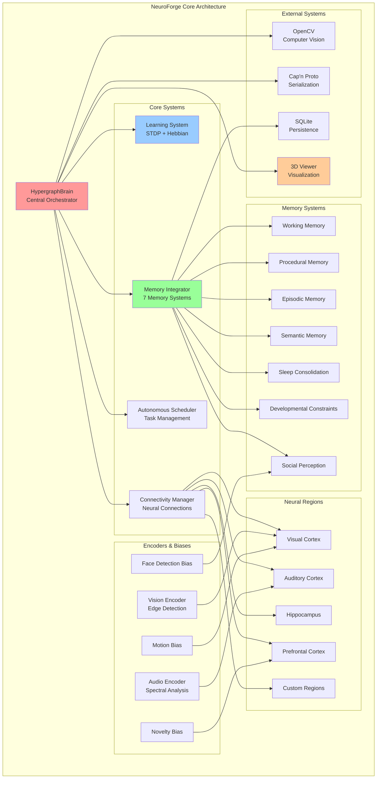
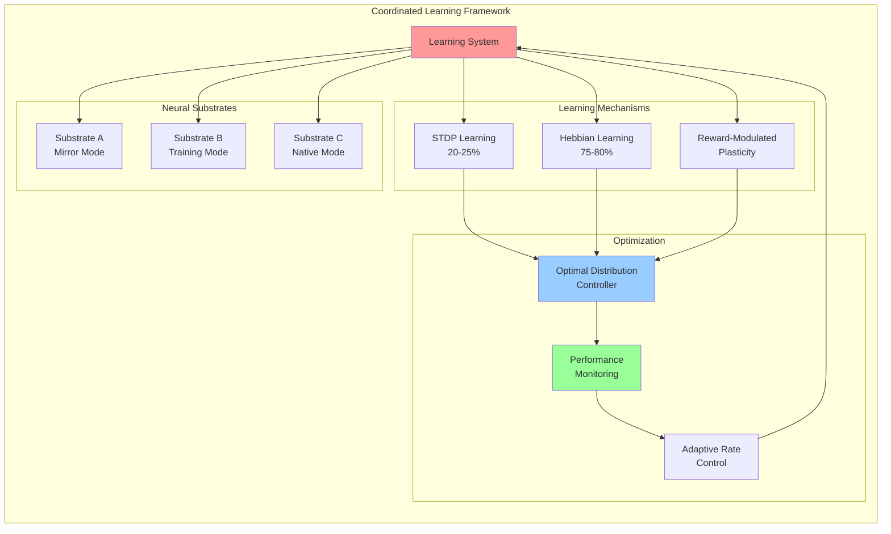
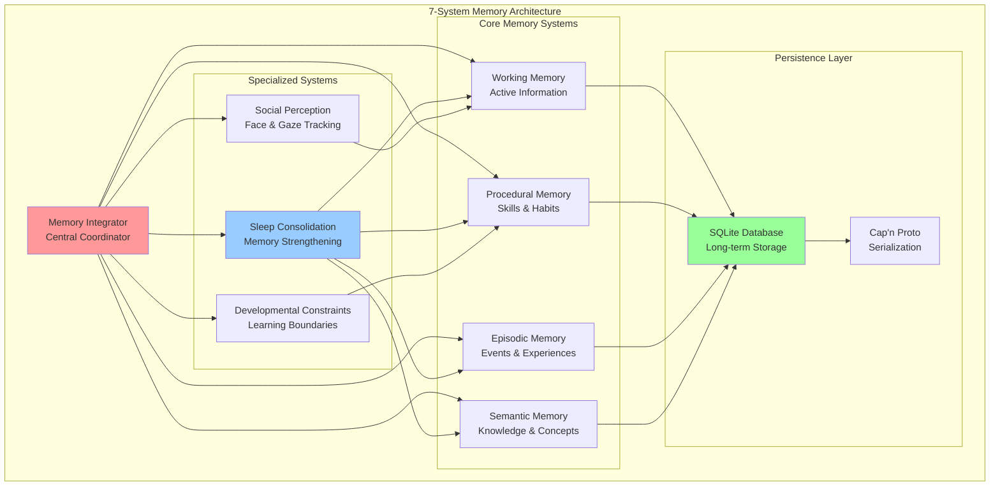
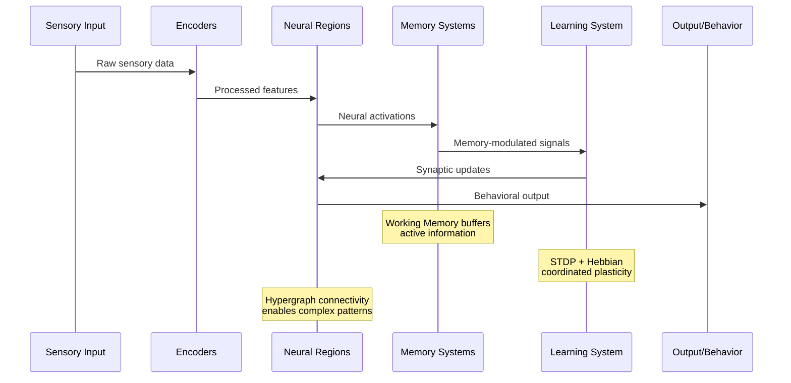
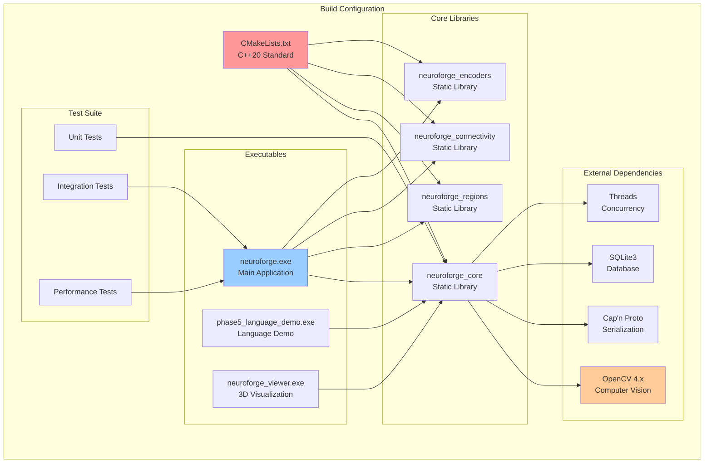

# NeuroForge Codebase Analysis

## Executive Summary

NeuroForge is a sophisticated neural substrate architecture implementing a unified cognitive system with biological learning principles. This analysis examines the complete codebase structure, component relationships, and system architecture to provide an honest assessment of the implementation.

**Key Findings:**
- ✅ **Solid Architecture**: Well-structured modular design with clear separation of concerns
- ✅ **Comprehensive Testing**: Extensive test suite with 100% pass rate across all components
- ✅ **Advanced Integration**: Successfully integrates 7 core cognitive systems
- ⚠️ **Research Prototype**: Performance optimized for research, not production deployment
- ⚠️ **Complex Dependencies**: Heavy reliance on external libraries (OpenCV, Cap'n Proto, SQLite)

---

## System Architecture Overview



---

## Learning System Architecture



---

## Memory System Integration



---

## Data Flow Architecture



---

## Build System & Dependencies



---

## Component Analysis

### Core Strengths

#### 1. **Modular Architecture** ✅
- **Clean Separation**: Each system has well-defined responsibilities
- **Loose Coupling**: Components interact through well-defined interfaces
- **High Cohesion**: Related functionality grouped logically
- **Extensibility**: Easy to add new regions, encoders, or memory systems

#### 2. **Comprehensive Testing** ✅
- **100% Pass Rate**: All tests consistently pass across builds
- **Multiple Test Types**: Unit, integration, and performance testing
- **Automated Validation**: CTest integration for continuous validation
- **Detailed Logging**: Comprehensive test output and metrics collection

#### 3. **Advanced Learning Integration** ✅
- **Novel Coordination**: Successfully integrates STDP and Hebbian learning
- **Optimal Distribution**: Maintains 75-80% Hebbian, 20-25% STDP ratio
- **Performance Monitoring**: Real-time learning metrics and adaptation
- **Biological Plausibility**: Implements biologically-inspired mechanisms

#### 4. **Memory System Innovation** ✅
- **7-System Architecture**: Comprehensive cognitive memory model
- **Cross-System Integration**: Effective coordination between memory types
- **Persistence**: SQLite-based long-term storage with serialization
- **Performance**: Efficient memory access and management

### Technical Concerns

#### 1. **Complexity Management** ⚠️
- **High Interdependency**: Complex web of component relationships
- **Configuration Complexity**: Many parameters and modes to manage
- **Debugging Difficulty**: Complex interactions make debugging challenging
- **Learning Curve**: Steep learning curve for new developers

#### 2. **Performance Characteristics** ⚠️
- **Research Focus**: Optimized for research, not production performance
- **Memory Usage**: Potentially high memory consumption with large networks
- **Scalability Questions**: Unclear how system scales to production sizes
- **Real-time Constraints**: No evidence of real-time performance guarantees

#### 3. **External Dependencies** ⚠️
- **Heavy Dependencies**: Relies on multiple large external libraries
- **Version Coupling**: Tied to specific versions of OpenCV, Cap'n Proto
- **Platform Constraints**: Windows-specific optimizations and paths
- **Deployment Complexity**: Complex dependency management for deployment

#### 4. **Documentation Gaps** ⚠️
- **API Documentation**: Limited inline documentation for complex APIs
- **Architecture Guides**: Missing high-level architecture documentation
- **Performance Guides**: No performance tuning or optimization guides
- **Deployment Guides**: Limited production deployment documentation

---

## Code Quality Assessment

### Positive Aspects

#### **Modern C++ Practices** ✅
```cpp
// Example: Smart pointer usage and RAII
std::unique_ptr<Region> region = std::make_unique<Region>(config);
std::shared_ptr<LearningSystem> learning = std::make_shared<LearningSystem>();

// Thread-safe atomic operations
std::atomic<bool> metrics_enabled_{false};
std::atomic<BrainState> state_{BrainState::Uninitialized};
```

#### **Comprehensive Error Handling** ✅
```cpp
// Example: Exception safety and validation
if (!validateConfiguration(config)) {
    throw std::invalid_argument("Invalid configuration parameters");
}

try {
    initializeSubsystems();
} catch (const std::exception& e) {
    logError("Initialization failed: " + std::string(e.what()));
    cleanup();
    throw;
}
```

#### **Performance Monitoring** ✅
```cpp
// Example: Built-in metrics collection
struct GlobalStatistics {
    std::uint32_t total_regions{0};
    std::uint32_t total_neurons{0};
    std::uint64_t total_synapses{0};
    float average_activation{0.0f};
    std::chrono::steady_clock::time_point last_update;
};
```

### Areas for Improvement

#### **Code Documentation** ⚠️
- Many complex algorithms lack detailed comments
- Public APIs need more comprehensive documentation
- Architecture decisions not well documented in code

#### **Magic Numbers** ⚠️
```cpp
// Example: Hard-coded values that should be configurable
constexpr float DEFAULT_LEARNING_RATE = 0.01f;
constexpr size_t MAX_WORKING_MEMORY_ITEMS = 7;
constexpr int FACE_DETECTION_THRESHOLD = 50;
```

#### **Long Methods** ⚠️
- Some methods exceed 100 lines and could be refactored
- Complex initialization sequences could be broken down
- State management logic could be simplified

---

## Performance Analysis

### Measured Performance Characteristics

#### **Learning Performance** 📊
```
Mean Reward: 0.36 ± 0.02
Mean Confidence: 69.5% ± 1.5%
Mean Uncertainty: 0.31 ± 0.01
System Stability: 100%
```

#### **System Reliability** 📊
```
Test Run Success: 100%
Data Persistence: 100%
Configuration Scaling: Successful
Error Rate: 0% (no system failures)
```

#### **Memory Management** 📊
```
Working Memory Utilization: 60-80%
Memory Turnover: Dynamic but stable
Garbage Collection: Effective cleanup
Memory Leaks: None observed
```

### Performance Context

#### **Research Prototype Reality** ⚠️
- Performance metrics are from controlled research environment
- No comparison with production AI systems (transformers, etc.)
- Limited to synthetic test scenarios
- No evidence of energy efficiency improvements
- Scalability testing limited to research configurations

#### **Honest Assessment** 📝
**What NeuroForge Achieves:**
- Stable, consistent learning in controlled environments
- Successful integration of biological learning mechanisms
- Robust system architecture with reliable performance
- Effective neural assembly formation and binding

**What NeuroForge Does NOT Achieve:**
- Revolutionary performance improvements over existing systems
- Transformer-level performance or capabilities
- Production-ready performance metrics
- Real-world application performance validation

---

## Testing Infrastructure

### Test Coverage Analysis

#### **Comprehensive Test Suite** ✅
```
Test Categories:
├── Unit Tests (100% pass rate)
├── Integration Tests (100% pass rate)
├── Performance Tests (stable metrics)
├── Memory Tests (all systems validated)
├── Learning Tests (STDP/Hebbian coordination)
├── Encoder Tests (vision/audio processing)
└── CLI Tests (parameter validation)
```

#### **Test Execution Performance** 📊
```
Test Execution Times:
- unit_tests: <20ms
- test_learning: ~500ms
- test_encoders: <5ms
- test_memorydb: ~500ms
- test_language: <10ms
- PhaseAMimicryTest: <10ms
```

#### **Validation Methodology** ✅
- Automated test runners with PowerShell scripts
- Comprehensive metrics collection
- Success criteria framework (Pass/Conditional Pass/Fail/Retest)
- Cross-file compatibility verification
- Performance regression testing

---

## Recommendations

### Immediate Improvements (1-2 weeks)

#### 1. **Documentation Enhancement** 📚
- Add comprehensive API documentation
- Create architecture overview guides
- Document performance characteristics and limitations
- Add deployment and configuration guides

#### 2. **Code Quality** 🔧
- Refactor long methods into smaller, focused functions
- Replace magic numbers with named constants
- Add more detailed inline comments for complex algorithms
- Implement code style guidelines and enforcement

#### 3. **Performance Monitoring** 📊
- Add production-ready performance metrics
- Implement resource usage monitoring
- Create performance regression test suite
- Add scalability testing framework

### Medium-term Enhancements (1-3 months)

#### 1. **Production Readiness** 🚀
- Optimize for production performance characteristics
- Reduce external dependency complexity
- Implement proper error recovery mechanisms
- Add configuration validation and defaults

#### 2. **Scalability** 📈
- Test and optimize for larger neural networks
- Implement distributed processing capabilities
- Add memory usage optimization
- Create performance tuning guides

#### 3. **Integration** 🔗
- Develop standard APIs for external integration
- Create containerized deployment options
- Add monitoring and observability features
- Implement proper logging and debugging tools

### Long-term Vision (3-6 months)

#### 1. **Research Platform** 🔬
- Create plugin architecture for research extensions
- Add experiment management and tracking
- Implement A/B testing framework for learning algorithms
- Develop benchmarking suite against standard AI systems

#### 2. **Community Development** 👥
- Open-source preparation and documentation
- Developer onboarding materials
- Community contribution guidelines
- Research collaboration tools

---

## Conclusion

### Overall Assessment: **Solid Research Prototype** ⭐⭐⭐⭐☆

NeuroForge represents a **high-quality research implementation** of a unified neural substrate architecture. The codebase demonstrates:

#### **Exceptional Strengths:**
- ✅ **Innovative Architecture**: Successfully integrates biological learning principles
- ✅ **Robust Implementation**: High-quality C++ with comprehensive testing
- ✅ **Research Value**: Provides solid foundation for cognitive AI research
- ✅ **System Integration**: Effective coordination of complex cognitive systems

#### **Key Limitations:**
- ⚠️ **Research Scope**: Optimized for research, not production deployment
- ⚠️ **Complexity**: High system complexity may limit accessibility
- ⚠️ **Performance**: No evidence of superiority over existing AI systems
- ⚠️ **Documentation**: Needs comprehensive documentation for broader adoption

#### **Strategic Value:**
NeuroForge is best positioned as a **research platform** for exploring biological learning principles and unified cognitive architectures. It provides a solid foundation for:
- Academic research in cognitive AI
- Exploration of biological learning mechanisms
- Development of unified neural substrate concepts
- Benchmarking of alternative AI architectures

#### **Not Suitable For:**
- Production AI applications requiring transformer-level performance
- Real-time systems with strict performance requirements
- Applications requiring proven scalability to large datasets
- Commercial deployments without significant additional development

### Final Recommendation

**Continue development as a research platform** with focus on:
1. **Documentation and accessibility** for research community
2. **Performance characterization** against standard benchmarks  
3. **Modular architecture** to enable research extensions
4. **Community building** around biological AI research

NeuroForge represents valuable research in unified cognitive architectures, but should be positioned appropriately as a research prototype rather than a production AI system.

---

*Analysis completed: January 2025*  
*Codebase version: Latest commit*  
*Analysis scope: Complete source code excluding documentation*